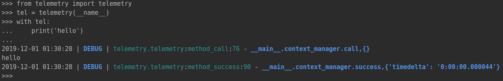
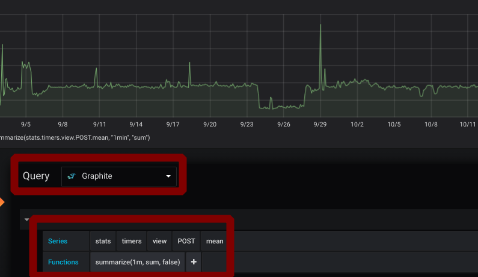

# Telemetry
## Description
Simple wrapper of [loguru](https://github.com/Delgan/loguru) and [statsd](https://github.com/jsocol/pystatsd).

Easy to use


Easy to visualize


## Installation
```bash
pip install git+https://github.com:andrey-avdeev/telemetry#egg=telemetry
```

## Configuration
Telemetry looking for these environment variables or use default values:
* LOG_LEVEL=DEBUG
* STATSD_ON=false
* STATSD_HOST=localhost
* STATSD_PORT=8125
* STATSD_PREFIX=dev.app
* STATSD_MAXUDPSIZE=512

## Usage
### Decorator
@tel.catch is equivalent of:

    tel.method_call(function._name)
    try:
        function()
        tel.method_success(function._name, timedelta=execution_time)
    except Exception as err:
        tel.method_error(function._name, err)
                
```python
from telemetry import telemetry

tel = telemetry(__name__)

class Monty:
    
    @tel.catch
    def python(self):
        print('python')
    
    @tel.catch(reraise=False)
    def java(self):
        raise Exception('java')

monty = Monty()

monty.python() # output: python
monty.java() # exception will be suppressed
```

### Context Manager
with tel: is equivalent of:

    tel.method_call(function._name)
    try:
        function()
        tel.method_success(function._name, timedelta=execution_time)
    except Exception as err:
        tel.method_error(function._name, err)
        
```python
from telemetry import telemetry

tel = telemetry(__name__)

class Monty:
    
    def python(self):
        with tel:
            print('python')
    
    def java(self):
        with telemetry('java'):
            raise Exception('java')
    
    @tel.catch
    def cpp(self):
        with telemetry(__name__, method='cpp'):
            print('cpp')

    def php(self):
        with telemetry(__name__, reraise=False):
            raise Exception('php')


monty = Monty()

monty.python() # output: python  
monty.java() # output: Exception
monty.cpp() # ouput: cpp
monty.php() # exception will be suppressed
```

### Direct
```python
from telemetry import telemetry

tel = telemetry(__name__)

tel.method_call('method_name')
tel.method_success('method_name')

try:
    1/0
except Exception as err:
    tel.method_error('method_name', err)

tel.log.debug('debug message') # access to loguru's logger directly
tel.stat.inc('service_name.eval.call.total', 1) # access to statsd client directly
```

## Infrastructure
You can up grafana and statsd+carbon+grafana by [docker-compose file](docker-compose.yml)
They will be available on 3000 and 80 ports
```shell script
git clone https://github.com/andrey-avdeev/telemetry.git && \
cd telemetry && \
docker-compose up
```
[How to install docker](https://docs.docker.com/v17.09/engine/installation/)

[How to install docker-compose](https://docs.docker.com/compose/install/)

[How to connect grafana to graphite](https://grafana.com/docs/features/datasources/graphite/)